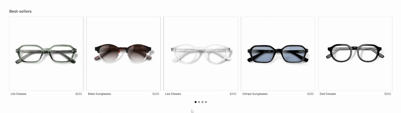
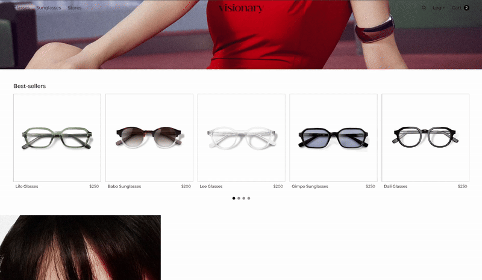

# Visionary - React.js

Visionary é um site e-commerce de óculos de grau e de sol, desenvolvido em React.js. O objetivo foi explorar e dominar o uso de React.js ao refazer um <a href="https://github.com/rebecaparreiras/visionary" target="_blank">site portfólio</a> criado anteriormente com JavaScript puro, tendo a oportunidade de adicionar novas funcionalidades e estética, demonstrando domínio das tecnologias base do desevolvimento web com React.js.

Neste projeto, o meu objetivo foi aprender React.js com foco nas soluções mais atuais e utilizadas pelas empresas para o desenvolvimento front-end de seus sites.  

  

 

## Uso de bibliotecas
O uso de bibliotecas no ecossistema React foi essencial para facilitar o desenvolvimento, manter o código mais limpo e garantir uma melhor experiência para o usuário. Usar bibliotecas me permitiu implementar funcionalidades avançadas com menos código e mais confiabilidade, evitando reinventar soluções já consolidadas.

### React Router 
Foi essencial para estruturar a navegação entre páginas sem recarregar a aplicação, garantindo uma experiência mais fluida para o usuário.

### Swiper 
Usei o Swiper para criar um <a href="https://github.com/rebecaparreiras/visionary-react/blob/main/visionary/components/ProductCarousel.jsx" target="_blank">carrossel de produtos</a> responsivo e com boa performance, facilitando a exibição interativa de produtos tanto para a versão desktop quanto mobile, uma vez que o Swiper é facilmente personalizável.

  

### react-helmet-async 
Permite gerenciar dinamicamente o 'head' do documento, como título da página e metadados. Isso é importante tanto para SEO quanto para melhorar a acessibilidade e a usabilidade da aplicação.

 

## Foco na escalabilidade
Busquei ao máximo seguir boas práticas de organização para grandes projetos, visto que Visionary é um e-commerce, o que possibilita maior separação de responsabilidades na estruturação interna tanto do projeto quanto de uma possível equipe de desenvolvedores. 

### Layout.jsx 
Usei o componente <a href="https://github.com/rebecaparreiras/visionary-react/blob/main/visionary/components/Layout.jsx" target="_blank">Layout.jsx</a> para agrupar outros componentes globais e os importar de uma só vez. Além disso, permite saber se um componente está presente em uma página, e só sobrepõe o conteúdo ao utilizar a funcionalidade useLocation do React Router.

### Array de produtos 'product.js' 
Criei um array de produtos <a href="https://github.com/rebecaparreiras/visionary-react/blob/main/visionary/src/data/products.js" target="_blank">'product.jsx'</a> usando .map, renderizando um componente <a href="https://github.com/rebecaparreiras/visionary-react/blob/main/visionary/components/ProductItem.jsx" target="_blank">ProductItem.jsx</a> para cada um dos itens do array, o que oferece ao projeto:

<ul>
<li><b>Escalabilidade:</b> para adicionar mais produtos, basta adicionar mais um item ao array;</li>
<li><b>Reusabilidade de componentes:</b> o ProductItem.jsx se torna reutilizável e encapsula toda a lógica de um único produto;</li>
<li><b>Gerenciamento de dados centralizado:</b> todos os dados do produto ficam em um só lugar, facilitando manutenção e manipulação;</li>
<li><b>Identificação rápida:</b> cada produto do array tem id único, permitindo rápida identificação para manipulações, como adicionar ao carrinho.</li>
</ul>

  

### ProductPage.jsx 
<a href="https://github.com/rebecaparreiras/visionary-react/blob/main/visionary/components/ProductPage.jsx" target="_blank">ProductPage.jsx</a> cria a página individual de cada produto. Centralizar essa lógica em um único componente permite reaproveitar o mesmo layout e estrutura para diferentes tipos de produtos, alterando apenas os dados recebidos.

### ProductItem.jsx + ProductDetails.jsx 

<ul>
<li><b><a href="https://github.com/rebecaparreiras/visionary-react/blob/main/visionary/components/ProductItem.jsx" target="_blank">ProductItem.jsx:</a></b> cria o layout base para a apresentação de um produto no site, para ser usado em grids ou carrosséis;</li>
<li><b><a href="https://github.com/rebecaparreiras/visionary-react/blob/main/visionary/pages/ProductDetails.jsx" target="_blank">ProductDetails.jsx:</a></b> renderiza a página de um produto individual conforme o id passado na rota, ou seja, torna possível navegar para uma rota como /products/1 e ver os detalhes do produto com id === "1".</li>
</ul>

### CSS Modules 
Optei por usar CSS Modules, pois é uma escolha estratégica para projetos escaláveis ao evitar conflitos de estilo, uma vez que garante que as classes CSS sejam aplicadas de forma local a cada componente. Isso me permitiu:

<ul>
<li><b>Isolamento de estilos:</b> cada componente tem seus próprios estilos, sem risco de sobrescrever ou ser sobrescrito por outros;</li>
<li><b>Fácil manutenção:</b> o código CSS fica mais organizado e fácil de entender, pois os estilos estão próximos ao componente que os utiliza;</li>
<li><b>Escalabilidade:</b> à medida que o projeto cresce, é possível adicionar novos componentes sem se preocupar com conflitos de nomes;</li>
<li><b>Melhor legibilidade:</b> estimula o uso de nomes de classe mais descritivos e curtos, já que o escopo é local.</li>
</ul>
